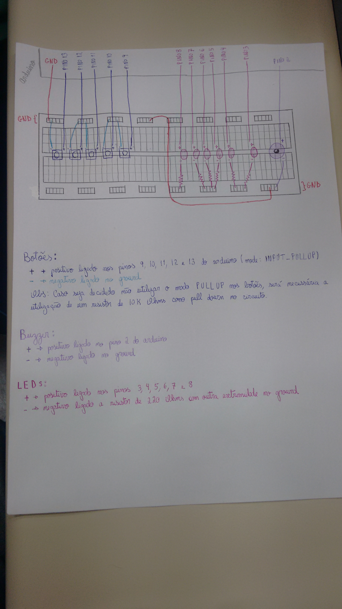

# Projeto Final de Arduino: Minigame "Não Exploda!"

## COMO JOGAR
O jogo se inicia com 5 jogadores e 5 leds acessos. Em cada rodada um dos Led's é sorteado 
aleatoriamente para conter uma bomba escondida. Os jogadores se revezam e apertam os botões 
que representam os Led's e aquele que apertar o que contem a bomba é eliminado. Uma nova 
rodada se inicia, porém com 4 jogadores, e as etapas se repetem eliminando um jogador por 
rodada até que haja um vencedor.

## MATERIAIS UTILIZADOS
- 20 Jumpers
- 5 Led's verdes e 1 Led vermelho
- 6 Resistores 220 Ohms
- 5 Push Buttons
- Buzzer 5 Voltz

## CONEXÕES NA PROTOBOARD
- Leds: digitalPin [mode:OUTPUT] -> Led -> Resistor 220 Ohm -> GND
- PushButtons: digitalPin [mode:INPUT_PULLUP] -> Push Button -> GND
- Buzzer: digitalPin [mode:OUTPUT] -> Buzzer -> GND
Obs: Caso se decida não utilizar o modo PULLUP nos Push Buttons, é necessário a 
utilização de um resistor de 10k Ohms como pull down no circuito.

## EXTRA
Ao fim de cada jogatina, o arduino executa um trecho de musica do jogo Legend 
of Zelda, sendo a partitura utilizada para a transcrição das notas devidamente
referênciadas no código.

## AUTORES
Gabriel Van Loon Bode da Costa Dourada Fuentes Rojas - gabrielvanloon@usp.br  
Tamiris Fernandes Tinelli - tamiris.tinelli@usp.br  
Mathias Fernandes Duarte Coelho - mathfernades@usp.br  

## DOCENTE E INSTITUTO
Prof. Eduardo do Valle Simões  
ICMC/USP - Jun/2018  
